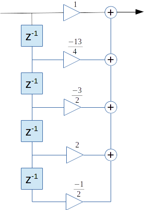
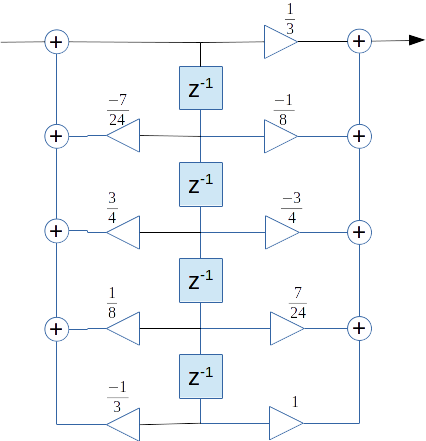
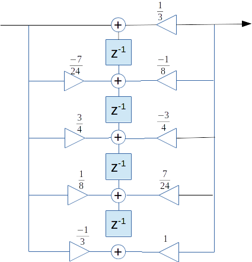
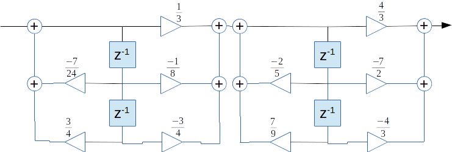
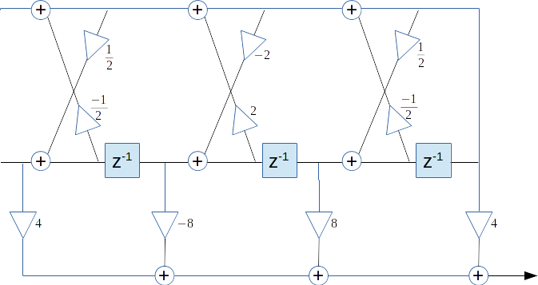

# Funzioni di trasferimento

Questa e' la parte piu' pratica relativa agli esercizi riguardanti la realizzazione di filtri FIR e IIR tramite funzioni di trasferimento.

## Legenda

- zeri (o radici):  valori per cui si annulla il numeratore
- poli:  valori per cui si annulla il denominatore
- coefficienti di riflessione:  coefficienti calcolati
- residui:  i coefficienti al numeratore ottenuti in fase di scomposizione in fratte parziali (avendo tutti gradi 1 al denominatore)

## Metodi di risoluzione

- fattorizzazione (regole imparate alle superiori)
- scomposizione in fratte parziali (vedi sotto)
- long division:  divisione tra 2 polinomi con metodo in colonna, affinche' l'esponente del numeratore sia inferiore a quello del denominatore
- calcolo tra coefficienti della scomposizione (da vedere)
- stabilita' BIBO:  verificare che tutti i poli (o i coefficienti di riflessione) abbiano modulo `< 1` (nota: `<`, non `<=`)

Nota: un filtro FIR (solo numeratore) e' sempre stabile per definizione

Consigli:

- `i^2 = -1` e quindi se hai `-1` puoi manipolare i segni e fare scomposizioni e fattorizzazioni ulteriori
- con `i` al denominatore, si puo' moltiplicare per `i / i` per portare `i` al numeratore
- TODO funzioni Octave per verificare gli esercizi (es: scomposizione in fratte parziali bidirezionali)

### Scomposizione in fratte parziali

Per scomporre un polinomio in frazioni parziali, mi è stato molto utile il corso [Partial Fractions: Khan Academy](https://www.khanacademy.org/math/algebra2/polynomial_and_rational/partial-fraction-expansion/).

## Tipologie

Tipi di realizzazione:

- diretta
- diretta II
- diretta II trasposta
- parallela di 2 filtri del secondo ordine, con diretta II
- traliccio
- traliccio-scala

In vari casi e' richiesto di determinare la stabilita' del filtro in senso BIBO.

### Diretta

Si disegna direttamente, di seguito un filtro FIR.

### Diretta II

E' sufficiente avere l'`1` come il coefficiente di `z^0` al denominatore.

### Diretta II trasposta

Come la diretta II, in cui bisogna:

- invertire versi dei triangolini
- sostituire `+` con `.` (e viceversa)
- altro?

### Cascata (in serie)

L'obiettivo e' ottenere il prodotto di piu' polinomi, principalmente attraverso la *fattorizzazione*.

### Parallelo

L'obiettivo e' ottenere la somma di piu' polinomi, principalmente attraverso la *scomposizione in fratte parziali*.

### Traliccio

Questa realizzazione prevede il calcolo dei *coefficienti di riflessione*.

1. Vediamo che il primo coefficiente e' gia' `1`, quindi ok

2. Prendiamo il primo `k` (ultimo coefficiente)

    

3. sottraiamo `k * H(z) a coefficienti invertiti`

    

    

4. dato che il primo coefficiente e' `!= 1`, moltiplichiamo di conseguenza

    

5. a questo punto ripetiamo fino ad ottenere 4 `k`

    

6. infine disegniamo il diagramma a traliccio

    

### Traliccio scala

Il traliccio scala e' simile alla realizzazione a traliccio aggiungendone una parte.

1. si parte dal denominatore e si cercano i coefficienti di riflessione, quindi come prima cosa otteniamo l'`1` come primo coefficiente del denominatore

    

2. quindi dato `k3 = 1/2`, sottraiamo a coefficienti invertiti come gia' visto per il traliccio

    

3. ripetiamo fino ad ottenere i 3 coefficienti

    

ma dobbiamo tenere in cache anche le varie fasi in cui si sviluppa il polinomio

    
    
    

4. a questo punto ripartiamo dal numeratore e facciamo lo stesso lavoro, pero' andando a sottrarre i coefficienti presi dal denominatore (dato `j3 = 4`)

    

5. calcoliamo cosi' 4 `j`

    

6. e andiamo infine a disegnare

    
